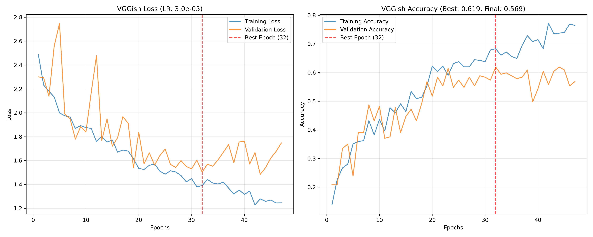

## VGG

### learning rate

Tego było duzo, ostatecznie dla CNN najlepsze wyniki otrzymuję przy kroku 7e-3, a VGGish przy 3e-5

**different schedulers for longer lerning sessions*8

config:
```
NUM_EPOCHS = 60
MODEL_PATIENCE = 15
WEIGHT_DECAY = 8e-4
LABEL_SMOOTHING = 0.15
NOISE_LEVEL = 0.002
scheduler = torch.optim.lr_scheduler.ReduceLROnPlateau(
    optimizer,
    mode="max",
    factor=0.75,
    patience=8,
    min_lr=effective_lr / 50,
    verbose=True,
)
AUDIO_LENGTH=3.97
```
same augemntation and model architecture

LEARNING_RATE = 8e-6


LEARNING_RATE = 3e-5

LEARNING_RATE = 4e-5

LEARNING_RATE = 5e-5

LEARNING_RATE = 6e-5


than the best batch 

than something else

**weight decay**

testowane dla LEARNING_RATE=3e-5

1e-4, 1e-3, 5e-4, 5e-3 ostatecznie dla dłuzszych batchy jest 8e-4

Wyniki z WEIGHT_DECAY = 1e-4 osiągnęły acc = 0.5 w 9 epoce

Wyniki z WEIGHT_DECAY = 1e-3 osiągnęły acc=0.52 w 9 epoce

Wyniki z WEIGHT_DECAY = 5e-4 osiągnęły acc=0.57 w 9 epoce

Wyniki z WEIGHT_DECAY = 5e-3 osiągnęły acc=0.46 w 8 epoce


Najlepsze rezultaty w 9 epoce prawdopodobnie wynikają ze schedulera ReduceLROnPlateau z patience równym 8

Dluzszy trening z 8e-4


1x30sek vs 1x3sek vs 10x3sek

Mogę puścić jeszcze raz, ale ogólnie samo accuracy jest podobne


## CNN

same stuff as vgg


## SVM

```
SVM_TEST_SIZE = 0.2  # Proportion of dataset to include in the test split
SVM_RANDOM_STATE = 42
SVM_PARAM_GRID = {
    "C": [0.1, 1, 2, 3, 4, 5, 6, 7, 8, 9, 10, 100],
    "kernel": ["linear", "rbf"],
    "gamma": ["scale", "auto", 0.1, 5e-3, 0.01, 0.1, 1],
}
SVM_FEATURES_FILTER = [
    "length",
    "chroma_stft_mean",
    "chroma_stft_var",
    "rms_mean",
    "rms_var",
    "spectral_centroid_var",
    "spectral_bandwidth_var",
    "rolloff_mean",
    "rolloff_var",
    "zero_crossing_rate_mean",
    "zero_crossing_rate_var",
    "harmony_mean",
    "harmony_var",
    "perceptr_mean",
    "perceptr_var",
    "tempo",
    "mfcc1_mean",
    "mfcc1_var",
    "mfcc2_var",
    "mfcc3_mean",
    "mfcc3_var",
    "mfcc4_mean",
    "mfcc4_var",
    "mfcc5_mean",
    "mfcc5_var",
    "mfcc6_mean",
    "mfcc6_var",
    "mfcc7_mean",
    "mfcc7_var",
    "mfcc8_mean",
    "mfcc8_var",
    "mfcc9_mean",
    "mfcc9_var",
    "mfcc10_mean",
    "mfcc10_var",
    "mfcc11_mean",
    "mfcc11_var",
    "mfcc12_mean",
    "mfcc12_var",
    "mfcc13_mean",
    "mfcc13_var",
    "mfcc14_mean",
    "mfcc14_var",
    "mfcc15_mean",
    "mfcc15_var",
    "mfcc16_mean",
    "mfcc16_var",
    "mfcc17_mean",
    "mfcc17_var",
    "mfcc18_mean",
    "mfcc18_var",
    "mfcc19_mean",
    "mfcc19_var",
    "mfcc20_mean",
    "mfcc20_var",
]
```