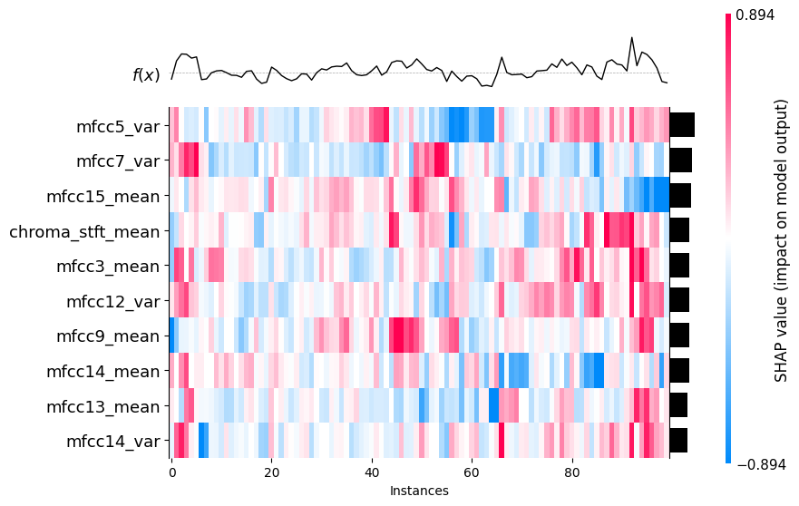
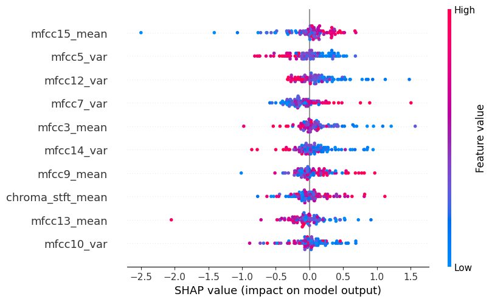

# XAI for SVM model
Explainable AI (XAI) aims to make machine learning models more transparent by helping us understand how features influence model predictions. One powerful method for this is SHAP (SHapley Additive exPlanations), which uses concepts from cooperative game theory to fairly distribute the model’s output among input features. SHAP values explain how much each feature contributes to a specific prediction, offering both global and local interpretability. The SHAP Python package provides practical tools for interpreting a wide range of models—from linear regression to deep neural networks—making it a widely adopted choice for model explanation.

### SHAP values
SHAP values (SHapley Additive exPlanations) represent the contribution of each feature to the prediction made by a machine learning model for a specific data point. They are based on game theory and show how much each feature increases or decreases the model’s output compared to the average prediction. This helps interpret complex models by explaining the influence of individual features on each prediction.

## Heatmap plot
The SHAP heatmap offers a detailed visualization of how input features affect model predictions across multiple samples. Each cell represents the SHAP value of a specific feature for a particular sample, with color indicating the direction and magnitude of the effect—red for positive impact and blue for negative. Samples are arranged along the x-axis, and features along the y-axis. Above the heatmap, model output values relative to the baseline are shown, while a bar plot on the side summarizes each feature’s overall importance. By grouping samples with similar explanation patterns, this plot highlights common decision rules, outliers, and key drivers of the model’s behavior.

To generate the plot, the GTZAN data used to train the model were utilized, with 100 randomly selected samples (the X-axis represents the individual samples).

## Beeswarm plot
The SHAP beeswarm plot provides a compact, information-rich summary of how the most important features influence a model’s predictions. Each dot represents an individual data instance’s SHAP value for a specific feature, with the dot’s horizontal position showing the impact on the model output. Dots stack vertically to indicate density, while their color reflects the original feature value. This visualization helps identify both feature importance and how different feature values affect the prediction.

## Waterfall plot
The SHAP waterfall plot provides a detailed breakdown of how individual feature contributions combine to form a single prediction. It starts from the model’s baseline output and sequentially adds or subtracts the impact of each feature, showing their positive or negative influence. The bars represent the magnitude and direction of each feature’s effect, with colors typically indicating increase or decrease in prediction value. This visualization helps understand the key drivers behind a specific prediction and how they accumulate to the final output.

For a selected single track, we can observe that mfcc7_var indicates that the model would "believe" more in this class if this feature were absent or less pronounced. The value of mfcc4_mean contributed the most to confirming that this is the correct class.

